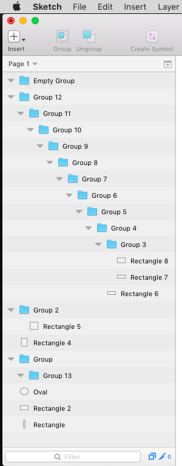
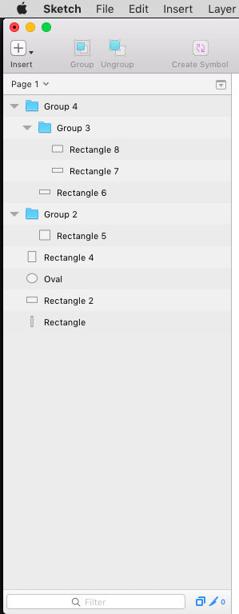

# Cleanup Useless Groups
 

Have you ever wished you could turn this

into this

with a flick of your fingers?

Stop wishing, and [download this plugin now](https://github.com/bomberstudios/Cleanup-Useless-Groups/archive/master.zip).

This plugin deletes empty groups in your document, and flattens deeply nested groups (i.e: a group that contains a group that contains a group that contains a group that…)

If you have any layer selected, it will only clean the selection, not the whole page.

